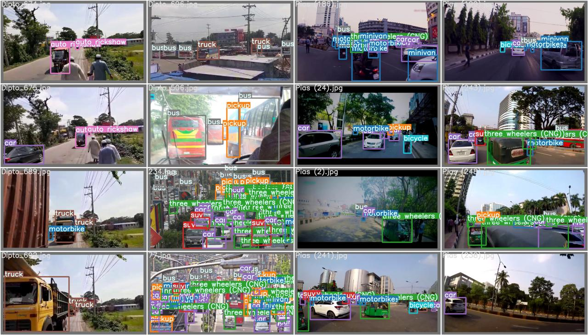

# BD_Vehicles_Detection
In this tutorial, I examine the YOLOv7 & its features, learn how to prepare custom datasets for the model, and build a YOLOv7 demo from scratch using the custom-generated Vehicles Dataset. the 21 classes of the dataset that are 
motorbike', 'pickup', 'three wheelers (CNG)', 'suv', 'car', 'truck', 'rickshaw', 'bus', 'human hauler', 'bicycle', 'minivan', 'ambulance', 'wheelbarrow', 'van', 'policecar', 'minibus', 'auto rickshaw', 'taxi', 'scooter', 'garbagevan', 'army vehicle etc.

So Here we train the detection model using the DB_vehicles dataset and try to leverage high performance for detection of the of Bangladesh Vehicles. Here we use around 3000 datasets for building this model.

## Installation
Tested with: Python 3.8 Pytorch 1.12.0+cu113
```
pip install torch==1.11.0+cu113 torchvision==0.12.0+cu113 -f https://download.pytorch.org/whl/torch_stable.html
Pip install -r requirements.txt
```
or 

``` shell
# create the docker container, you can change the share memory size if you have more.
nvidia-docker run --name yolov7 -it -v your_coco_path/:/coco/ -v your_code_path/:/yolov7 --shm-size=64g nvcr.io/nvidia/pytorch:21.08-py3

# apt install required packages
apt update
apt install -y zip htop screen libgl1-mesa-glx

# pip install required packages
pip install seaborn thop

# go to code folder
cd /yolov7
```

# Data Processing

Please check the data processing repo [click](https://github.com/ultralytics/JSON2YOLO) script is ```general_json2yolo.py```

Traning Data structure,
```sh
dataset
├── annotations
│   ├── training.json
│   └── valivation.json
├── images
│   ├── training
│   │    ├── 01.jpg
│   │    └── 02.jpg
│   └── valivation
│   │   ├── 03.jpg
│   │   └── 04.jpg
├── labels
│   ├── training
│   │   ├── 01.txt
│   │   └── 02.txt
│   └── valivation
│   │   ├── 03.jpg
│   │   └── 04.jpg
├── training.txt
│    ├──./images/training/01.jpg
│    └──./images/training/02.jpg
└── validation.txt
    ├──./images/valivation/03.jpg
    └──./images/valivation/04.jpg
```

## Label should be below this type of format,

Example: 01.txt
```
if the coordiante like this : [x-min, y-min, x-max, y-max] or [x1, y1, x2, y2]

# normalize x by width[image width]
# normalize y by height[image height]
```
```
class_index Norimalize of [x1,y1, x2, y2] 
      7     0.799583 0.424375 0.0975 0.13875

```


To measure accuracy, download [COCO-annotations for Pycocotools](http://images.cocodataset.org/annotations/annotations_trainval2017.zip) to the `./coco/annotations/instances_val2017.json`

## Coco dataset

Data preparation

``` shell
bash scripts/get_coco.sh
```
* Download MS COCO dataset images ([train](http://images.cocodataset.org/zips/train2017.zip), [val](http://images.cocodataset.org/zips/val2017.zip), [test](http://images.cocodataset.org/zips/test2017.zip)) and [labels](https://github.com/WongKinYiu/yolov7/releases/download/v0.1/coco2017labels-segments.zip). If you have previously used a different version of YOLO, we strongly recommend that you delete `train2017.cache` and `val2017.cache` files, and redownload [labels](https://github.com/WongKinYiu/yolov7/releases/download/v0.1/coco2017labels-segments.zip) 


# Traning Configuration


check ```cfg/training/yolov7.yaml```
```python
# set number of class 
nc: 21  # number of classes
```
check ```data/coco.yaml```
```python
train: ./dataset/training.txt  # 118287 images
val: ./dataset/validation.txt  # 5000 images

# number of classes
nc: 21

names : [ 'motorbike', 'pickup', 'three wheelers (CNG)', 'suv', 'car', 'truck', 'rickshaw', 'bus', 'human hauler', 'bicycle', 
          'minivan', 'ambulance', 'wheelbarrow', 'van', 'policecar', 'minibus', 'auto rickshaw', 'taxi', 'scooter', 'garbagevan', 
          'army vehicle']

```
# Training 
Single GPU training

``` shell
# train p5 models
python train.py --workers 8 --device 0 --batch-size 32 --data data/coco.yaml --img 640 640 --cfg cfg/training/yolov7.yaml --weights '' --name yolov7 --hyp data/hyp.scratch.p5.yaml

# train p6 models
python train_aux.py --workers 8 --device 0 --batch-size 16 --data data/coco.yaml --img 1280 1280 --cfg cfg/training/yolov7-w6.yaml --weights '' --name yolov7-w6 --hyp data/hyp.scratch.p6.yaml
```

Multiple GPU training

``` shell
# train p5 models
python -m torch.distributed.launch --nproc_per_node 4 --master_port 9527 train.py --workers 8 --device 0,1,2,3 --sync-bn --batch-size 128 --data data/coco.yaml --img 640 640 --cfg cfg/training/yolov7.yaml --weights '' --name yolov7 --hyp data/hyp.scratch.p5.yaml

# train p6 models
python -m torch.distributed.launch --nproc_per_node 8 --master_port 9527 train_aux.py --workers 8 --device 0,1,2,3,4,5,6,7 --sync-bn --batch-size 128 --data data/coco.yaml --img 1280 1280 --cfg cfg/training/yolov7-w6.yaml --weights '' --name yolov7-w6 --hyp data/hyp.scratch.p6.yaml
```

## Transfer learning

[`yolov7_training.pt`](https://github.com/WongKinYiu/yolov7/releases/download/v0.1/yolov7_training.pt) [`yolov7x_training.pt`](https://github.com/WongKinYiu/yolov7/releases/download/v0.1/yolov7x_training.pt) [`yolov7-w6_training.pt`](https://github.com/WongKinYiu/yolov7/releases/download/v0.1/yolov7-w6_training.pt) [`yolov7-e6_training.pt`](https://github.com/WongKinYiu/yolov7/releases/download/v0.1/yolov7-e6_training.pt) [`yolov7-d6_training.pt`](https://github.com/WongKinYiu/yolov7/releases/download/v0.1/yolov7-d6_training.pt) [`yolov7-e6e_training.pt`](https://github.com/WongKinYiu/yolov7/releases/download/v0.1/yolov7-e6e_training.pt)

Single GPU finetuning for custom dataset

``` shell
# finetune p5 models
python train.py --workers 8 --device 0 --batch-size 32 --data data/custom.yaml --img 640 640 --cfg cfg/training/yolov7-custom.yaml --weights 'yolov7_training.pt' --name yolov7-custom --hyp data/hyp.scratch.custom.yaml

# finetune p6 models
python train_aux.py --workers 8 --device 0 --batch-size 16 --data data/custom.yaml --img 1280 1280 --cfg cfg/training/yolov7-w6-custom.yaml --weights 'yolov7-w6_training.pt' --name yolov7-w6-custom --hyp data/hyp.scratch.custom.yaml
```

## Re-parameterization

See [reparameterization.ipynb](tools/reparameterization.ipynb)

## Evaluation





## Inference

On video:
``` shell
python detect.py --weights yolov7.pt --conf 0.25 --img-size 640 --source yourvideo.mp4
```

On image:
``` shell
python detect.py --weights yolov7.pt --conf 0.25 --img-size 640 --source inference/images/1.jpg
```


## Testing

[`yolov7.pt`](https://github.com/WongKinYiu/yolov7/releases/download/v0.1/yolov7.pt) [`yolov7x.pt`](https://github.com/WongKinYiu/yolov7/releases/download/v0.1/yolov7x.pt) [`yolov7-w6.pt`](https://github.com/WongKinYiu/yolov7/releases/download/v0.1/yolov7-w6.pt) [`yolov7-e6.pt`](https://github.com/WongKinYiu/yolov7/releases/download/v0.1/yolov7-e6.pt) [`yolov7-d6.pt`](https://github.com/WongKinYiu/yolov7/releases/download/v0.1/yolov7-d6.pt) [`yolov7-e6e.pt`](https://github.com/WongKinYiu/yolov7/releases/download/v0.1/yolov7-e6e.pt)

``` shell
python test.py --data data/coco.yaml --img 640 --batch 32 --conf 0.001 --iou 0.65 --device 0 --weights yolov7.pt --name yolov7_640_val
```

```shell
wget https://github.com/WongKinYiu/yolov7/releases/download/v0.1/yolov7-tiny.pt
python export.py --weights yolov7-tiny.pt --grid --include-nms
git clone https://github.com/Linaom1214/tensorrt-python.git
python ./tensorrt-python/export.py -o yolov7-tiny.onnx -e yolov7-tiny-nms.trt -p fp16

# Or use trtexec to convert ONNX to TensorRT engine
/usr/src/tensorrt/bin/trtexec --onnx=yolov7-tiny.onnx --saveEngine=yolov7-tiny-nms.trt --fp16
```

</details>

## Official git repo

git repo : [click](https://github.com/WongKinYiu/yolov7)

Thanks ```WongKinYiu``` for giving amazing git repo

## Acknowledgements

<details><summary> <b>Expand</b> </summary>

* [https://github.com/AlexeyAB/darknet](https://github.com/AlexeyAB/darknet)
* [https://github.com/WongKinYiu/yolor](https://github.com/WongKinYiu/yolor)
* [https://github.com/WongKinYiu/PyTorch_YOLOv4](https://github.com/WongKinYiu/PyTorch_YOLOv4)
* [https://github.com/WongKinYiu/ScaledYOLOv4](https://github.com/WongKinYiu/ScaledYOLOv4)
* [https://github.com/Megvii-BaseDetection/YOLOX](https://github.com/Megvii-BaseDetection/YOLOX)
* [https://github.com/ultralytics/yolov3](https://github.com/ultralytics/yolov3)
* [https://github.com/ultralytics/yolov5](https://github.com/ultralytics/yolov5)
* [https://github.com/DingXiaoH/RepVGG](https://github.com/DingXiaoH/RepVGG)
* [https://github.com/JUGGHM/OREPA_CVPR2022](https://github.com/JUGGHM/OREPA_CVPR2022)
* [https://github.com/TexasInstruments/edgeai-yolov5/tree/yolo-pose](https://github.com/TexasInstruments/edgeai-yolov5/tree/yolo-pose)

</details>
